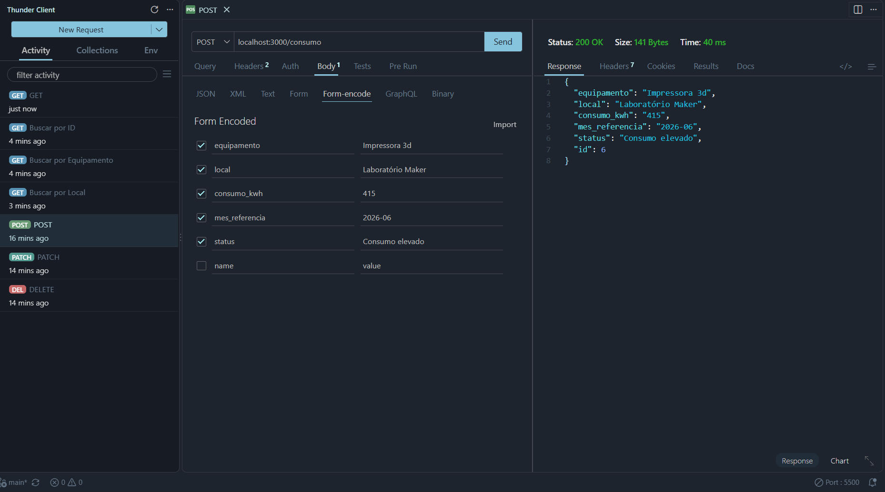
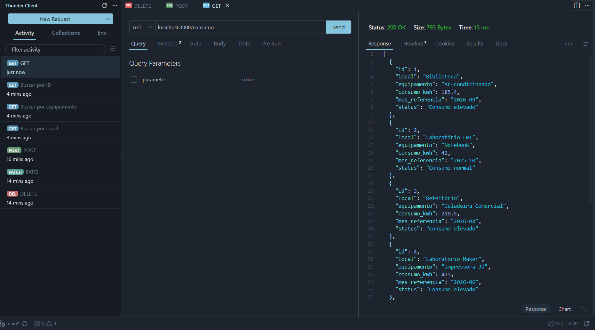
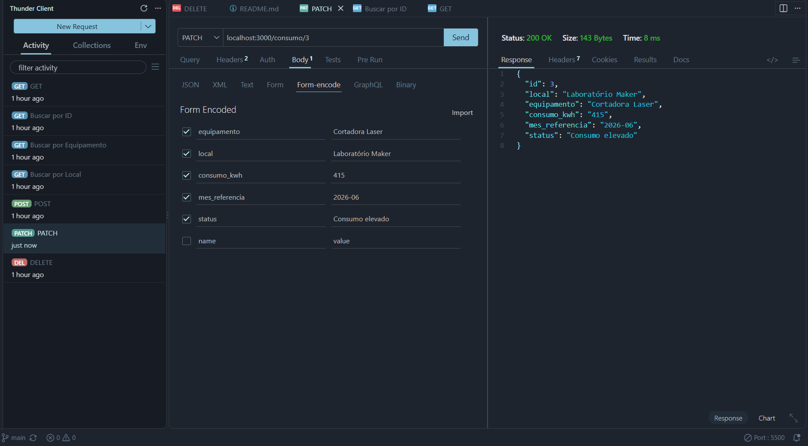
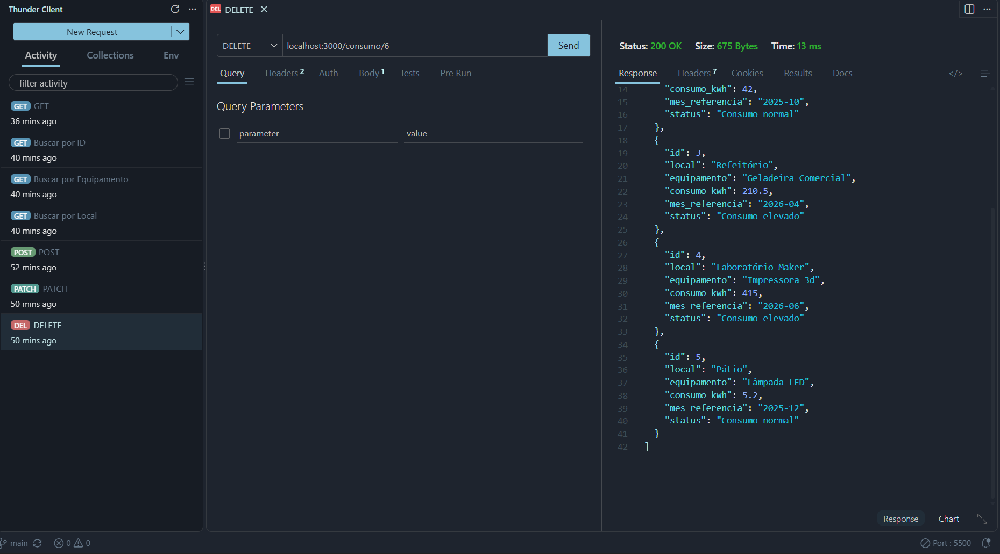
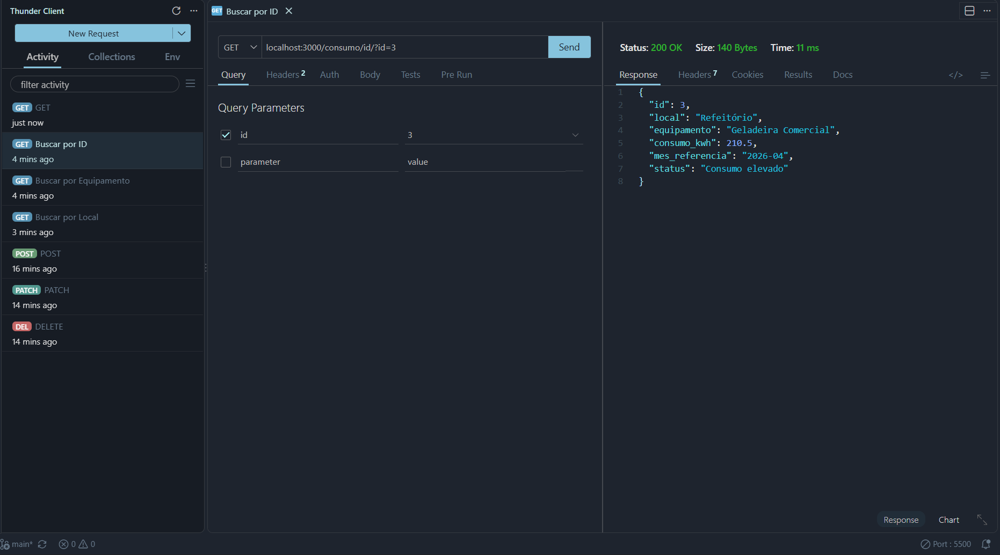
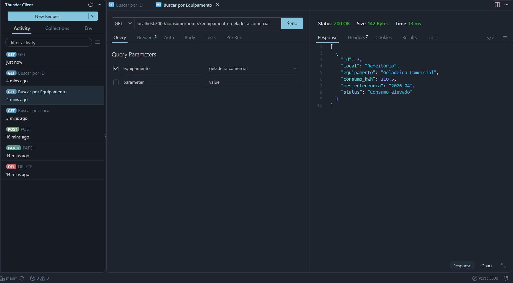
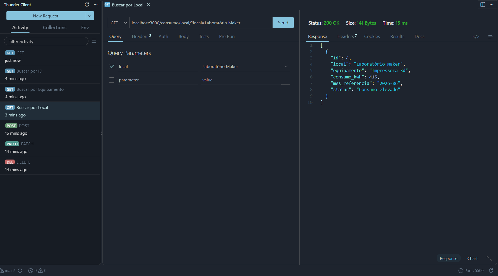
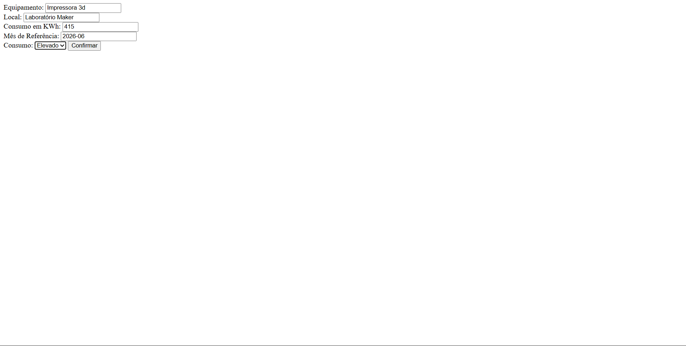
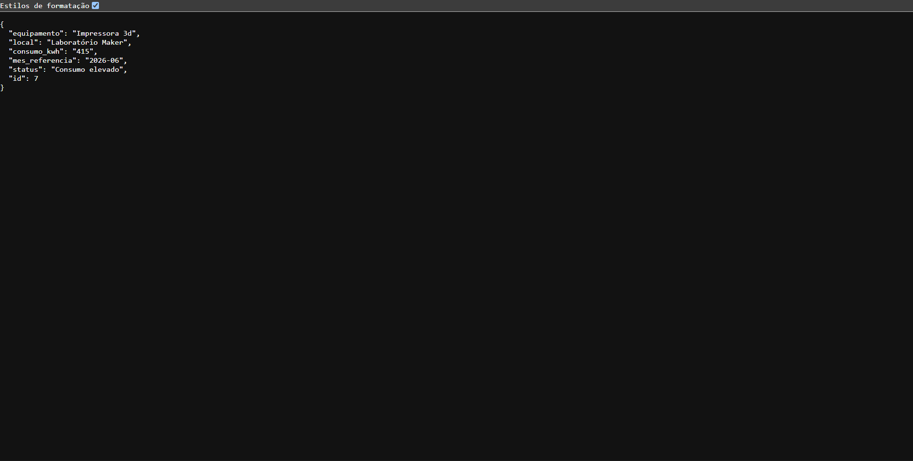

# VPF01 - Back-End - Rastreamento de consumo e disperdício de energia
Atividade avaliativa de back-end com mockup em dados .JSON e funcionalidades CRUD padrão.
## Tecnologias
- **Node.sj;**
- **JavaScript;**
- **VsCode;**
- **VsCode** Thunder Client;
- **VsCode** Live Server.
## Passos para testar
1- Clone este repositório;

2- Abra com o **VSCode** e em um terminal, digite:
```cmd
npm install
npm run dev
```
3- Teste as rotas com a extensão `Thunder Client` do **VSCode**;

4- Abra o arquivo `client/index.html` com a extensão `Live Server` do **VSCode**.

## Print dos testes e exemplo de requisições

- Cadastrar novo equipamento:



- Ler todos os equipamentos:



- Atualizar um item por ID:



- Deletar um item por ID:



- Buscar um item específico por ID:



- Buscar um item específico pelo nome do equipamento:



- Buscar um item específico por local:



## Cliente

- Formulário:



- Resposta:


